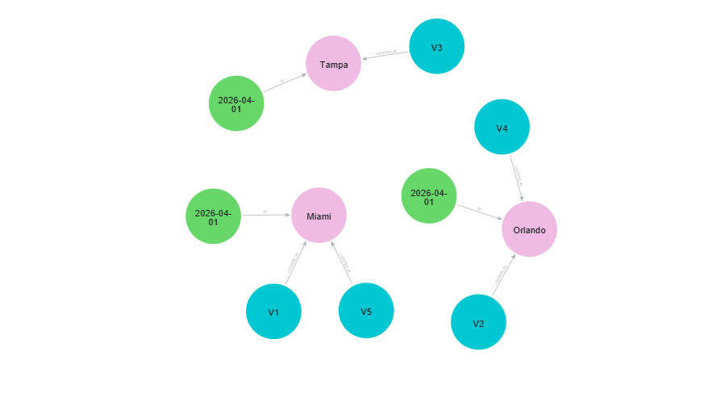
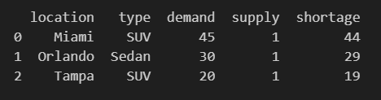
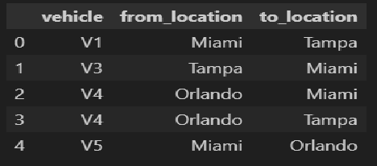

# Fleet Knowledge Graph for Demand-Aware Vehicle Allocation

## 🚗 Overview
This project SKEMATICALLY demonstrates how a **Knowledge Graph (Neo4j)** can be used to improve **fleet strategy and planning decisions**.

It models relationships between:
- Vehicles
- Locations
- Demand
- Reservations

and answers key business questions such as:
- Where do we have vehicle shortages?
- How should we rebalance the fleet?
- What is the revenue impact?

---

## 🎯 Business Problem
Fleet operators often face:
- Underutilized vehicles in low-demand areas
- Shortages in high-demand locations
- Inefficient rebalancing decisions

---

## 💡 Solution
We build a **graph-based model** where:
- Vehicles are connected to locations
- Demand is linked to locations and time
- Queries identify shortages and rebalancing opportunities

---

## 🧠 Graph Model (Neo4j)
```cypher
(Vehicle)-[:LOCATED_IN]->(Location)
(Demand)-[:AT]->(Location)
(Vehicle)-[:MATCHES]->(Demand)
```
## 📂 Project Structure

```markdown
fleet-knowledge-graph/
│
├── data/
├── src/
├── notebooks/
├── requirements.txt
└── README.md
```

## ⚙️ Setup 

### 1. Install dependencies
```bash
pip install -r requirements.txt
```

## ⚙️ Run Neo4j (locally)

- Download Neo4j
- Default:
- URI: bolt://localhost:7687

## ▶️ Run Project

python src/build_graph.py
python src/queries.py

## 🔍 Example Insights
- Shortage Detection
- Identifies locations where demand exceeds supply.
- Fleet Rebalancing
- Suggests moving vehicles from low-demand to high-demand areas.

## 📈 Example Output

Location: Miami | Demand: 45 | Supply: 10 | Shortage: 35

## 🚀 Future Improvements

- Integrate real-time data (e.g., telematics platforms like Samsara)
- Add pricing optimization
- Build dashboard (Streamlit)
- and much more with AI

## 💼 Resume Bullet

Built a Neo4j-based knowledge graph to model fleet vehicles, locations, and demand, enabling demand-aware allocation and rebalancing decisions.

---

## 📦 requirements.txt
- neo4j
- pandas

---

## 📁 data/vehicles.csv

```csv
vehicle_id,type,location,mileage,status
V1,SUV,Miami,30000,available
V2,Sedan,Orlando,25000,available
V3,SUV,Tampa,40000,maintenance
V4,SUV,Orlando,20000,available
V5,Sedan,Miami,15000,available
```
## 📁 data/demand.csv

```csv
location,date,vehicle_type,demand
Miami,2026-04-01,SUV,45
Orlando,2026-04-01,Sedan,30
Tampa,2026-04-01,SUV,20
```
## 📁 src/build_graph.py

```python

from neo4j import GraphDatabase
import pandas as pd

URI = "bolt://localhost:7687"
AUTH = ("neo4j", "password")

driver = GraphDatabase.driver(URI, auth=AUTH)

def clear_db(tx):
    tx.run("MATCH (n) DETACH DELETE n")

def create_vehicle(tx, vid, vtype, location):
    tx.run("""
        MERGE (v:Vehicle {id: $vid})
        SET v.type = $vtype
        WITH v
        MERGE (l:Location {name: $location})
        MERGE (v)-[:LOCATED_IN]->(l)
    """, vid=vid, vtype=vtype, location=location)

def create_demand(tx, location, date, vtype, demand):
    tx.run("""
        MERGE (d:Demand {location: $location, date: $date, vehicle_type: $vtype})
        SET d.demand = $demand
        WITH d
        MERGE (l:Location {name: $location})
        MERGE (d)-[:AT]->(l)
    """, location=location, date=date, vtype=vtype, demand=demand)

def load_data():
    vehicles = pd.read_csv("data/vehicles.csv")
    demand = pd.read_csv("data/demand.csv")

    with driver.session() as session:
        session.execute_write(clear_db)

        for _, row in vehicles.iterrows():
            session.execute_write(
                create_vehicle,
                row["vehicle_id"],
                row["type"],
                row["location"]
            )

        for _, row in demand.iterrows():
            session.execute_write(
                create_demand,
                row["location"],
                row["date"],
                row["vehicle_type"],
                row["demand"]
            )

if __name__ == "__main__":
    load_data()
    print("Graph successfully built.")
```

## 📁 src/queries.py

```python
from neo4j import GraphDatabase

URI = "bolt://localhost:7687"
AUTH = ("neo4j", "password")

driver = GraphDatabase.driver(URI, auth=AUTH)

def shortage_query(tx):
    result = tx.run("""
        MATCH (d:Demand)-[:AT]->(l:Location)
        MATCH (v:Vehicle)-[:LOCATED_IN]->(l)
        WHERE v.type = d.vehicle_type
        RETURN l.name AS location,
               d.vehicle_type AS type,
               d.demand AS demand,
               count(v) AS supply,
               d.demand - count(v) AS shortage
        ORDER BY shortage DESC
    """)
    return result.data()

def rebalance_query(tx):
    result = tx.run("""
        MATCH (l1:Location)<-[:LOCATED_IN]-(v:Vehicle),
              (l2:Location)<-[:AT]-(d:Demand)
        WHERE l1 <> l2 AND v.type = d.vehicle_type
        RETURN v.id AS vehicle,
               l1.name AS from_location,
               l2.name AS to_location
        LIMIT 10
    """)
    return result.data()

def run_queries():
    with driver.session() as session:
        print("\n--- Shortages ---")
        for row in session.execute_read(shortage_query):
            print(row)

        print("\n--- Rebalancing Suggestions ---")
        for row in session.execute_read(rebalance_query):
            print(row)

if __name__ == "__main__":
    run_queries()

```

## 📸 2️⃣ Query Results — Shortage Detection

What the output should look like:

```markdown
Location | Type | Demand | Supply | Shortage
Miami    | SUV  | 45     | 1      | 44
Orlando  | Sedan| 30     | 1      | 29
```


## 📸 Graph Visualization (to be provided)


## 📊 Shortage Detection


## 🔄 Rebalancing


## 📁 Note about notebooks

We create a notebook with:
- graph visualization (optional)
- run queries
- explained results   

## 🚀 Optional Upgrade Ideas (for the actual project)

- Streamlit dashboard
- Florida-specific demand simulation 
- Pricing model
- Integration with real-time telematics (like Samsara)
- and much more

